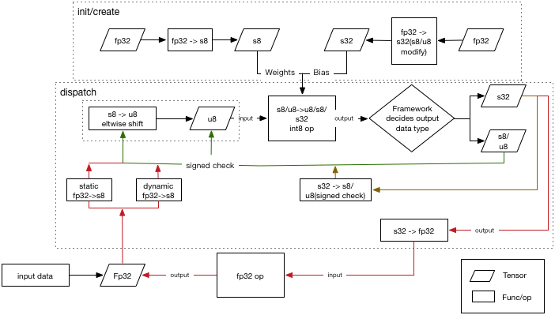

# Int8设计文档

## 计算流程

## saber完成的功能

对于支持int8的op，接口需要完成的功能做如下规定：
1、init／create部分完成外部变量的量化和应有的判断，weights和bias计算后，scale存回对应的tensor

2、dispatch检查input，如果是int8，检查是否符号合适，如果是fp32，需要添加量化部分代码（静态量化在tensor中的scale里，动态量化需要实时计算，并存回原tensor的scale中）。检查output，如果是fp32，按照输出fp32的逻辑反量化回fp32的tensor，如果是int8，根据当前kernel的实现，选择输出s8或u8（对于带relu合并的输出u8，对于单独的conv输出s8）。

3、输入是s8还是u8主要取决于kernel是否支持，跟设备相关。

对于不支持fp32的op，需要确认输入输出都是fp32，防止误调用。
